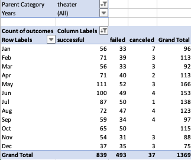
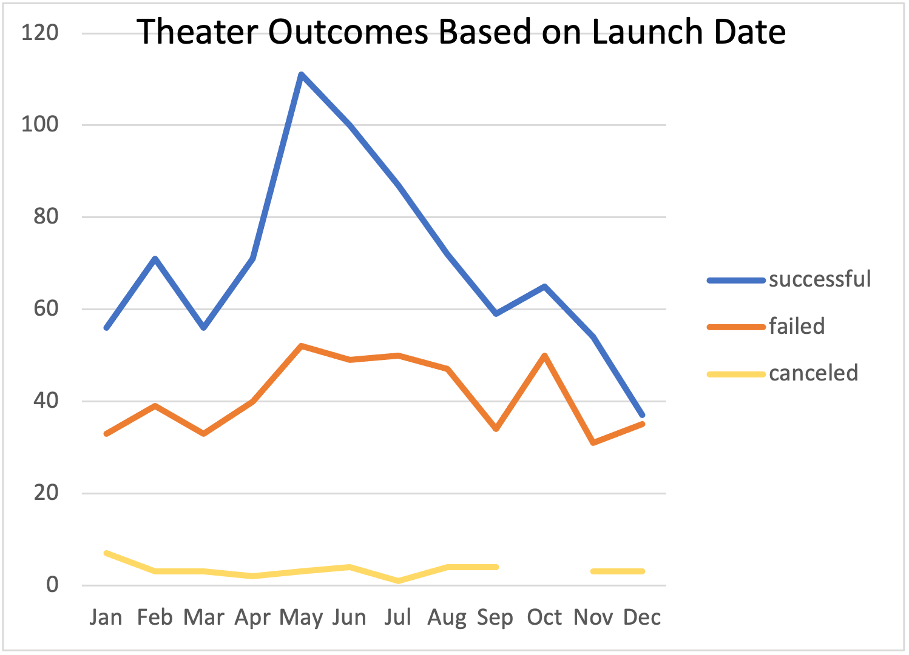
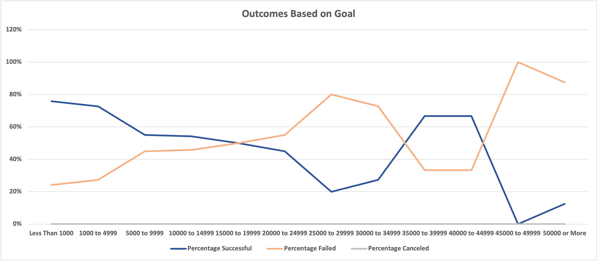

# Kickstarting with Excel

## Overview of Project

### Purpose

Louise is wanting to raise enough money for her play, Fever, in the US which will estimate around $12,000. We have collected the data from Kickstarter which is a crowdfunding platoform where we can see over 4,000 campaigns that have raised money for projects similar to Louise's. We will be using this data to help Louise find trends that have created sucessful campaigns, while we can also see that many of the campaigns failed to hit their goal mark and what played a factor in that. We tailored our data to look at "theatrical plays" specifically. This way we are able to give Louise the best analysis on how she can create a successful campaign for her play.

## Analysis and Challenges

### Analysis of Outcomes Based on Launch Date

By creating a pivot table, I was able to see an analysis of Outcomes Based on Launch Date. I was able to accurately create this table by filtering fields down to outcomes in the columns section, date-created to the rows section, and outcomes to the value section. From there, I filtered the data out to specify the years and parent category section. I was then able to filter out the parent category to showcase on theater data, where I broke it out into successful, failed, canceled, and total campaigns. Below are the results of the Outcomes Based on Launch Date pivot table and line chart:

### Analysis of Outcomes Based on Goals

By creating a new table using the COUNTIFS function you can display the Outcomes Based on Goals in a line graph. By doing so I was able to gather the numbers for successful, failed, and canceled campigns in their receptive goal category. I was able to then convert this to percentage after totaling up the project amounts. This is how I was able to create the line graph, to give us a better visual of the overall success rate of theater campaigns based on their goals, as displayed below:

 

### Challenges and Difficulties Encountered

I did not come across any challeneges other than making sure the right COUNTIFS function was used and that I had broken it down into the correct filter with the correct goal spand. I can see how this can get confusing, if the equation is not filtered correctly and changed appropriately with each goal category the numbers can go all over the place and not add up correctly. 

## Results

When looking for the best time for Louise to launch her campaign we can see in our line chart that May was the most successful month. While, January, October, June, and July all had around the same number of failed campaign launches. When we filter our chart to theater, we can see that this is a very popular and successful type of campaign overall. We can see that June is a successful time to launch a campaign in this category, in which I would recommend to Louise to launch hers in the month of June. 

Looking at data for plays in GB, since Louise showed interest in this market; budgeting 4,000 pounds. We used a box plot to look at the big picture. We can see that most plays had their campaign goals at less than half of what Louise's is. She should look at getting her play produced for less than 4,000 pounds, around 2,000 pounds would be more reasonable.

I would recommend that Louise kicks off her campaign in June in order to have the best chance of having a sucessful campaign. Though her goal of $12,000 in the US is high compared to other theater campaigns, it is not unattainable, with having 525 successful US theater kickstarters out of 912. Incentives for donors would also be helpful. If she is to launch a campaign in GB, I would recommend cutting her goal in half in order to have a successful campaign. 

When only using one crowdfunding platform, like Kickstarter, we are limiting ourself to data. If we wanted to dive even deeper into data I would recommend using more corwdfunding platofrms to gather data from that have theater categories. 

We could use a box and whisker chart to get a better idea of data points across specific measures. This could help when looking at money raised to get a better idea of the mean, meadian, and mode for successful campaigns. 

